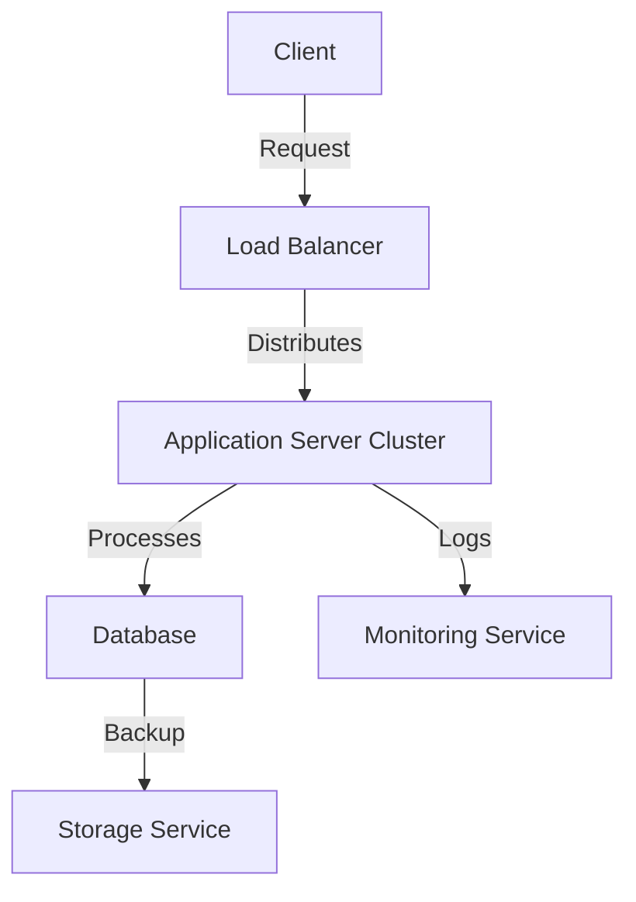

## Architecture Diagram



## Runbooks

### Restarting the Application Server

1. Log in to the server.
2. Stop the application service:
   ```bash
   sudo systemctl stop app-service
   ```
3. Start the application service:
   ```bash
   sudo systemctl start app-service
   ```
4. Verify the service is running:
   ```bash
   sudo systemctl status app-service
   ```

### Scaling the Application

1. Update the load balancer configuration to include new servers.
2. Deploy the application to the new servers.
3. Verify the new servers are handling traffic.

## Troubleshooting Guide

### Issue: Application is Unresponsive

1. Check the application logs:
   ```bash
   tail -f /var/log/app.log
   ```
2. Verify the application service is running:
   ```bash
   sudo systemctl status app-service
   ```
3. Check the database connection:
   ```bash
   ping database-host
   ```
4. Restart the application service if needed.

### Issue: High Latency

1. Check server resource usage:
   ```bash
   top
   ```
2. Verify the load balancer is distributing traffic evenly.
3. Scale the application if necessary.
